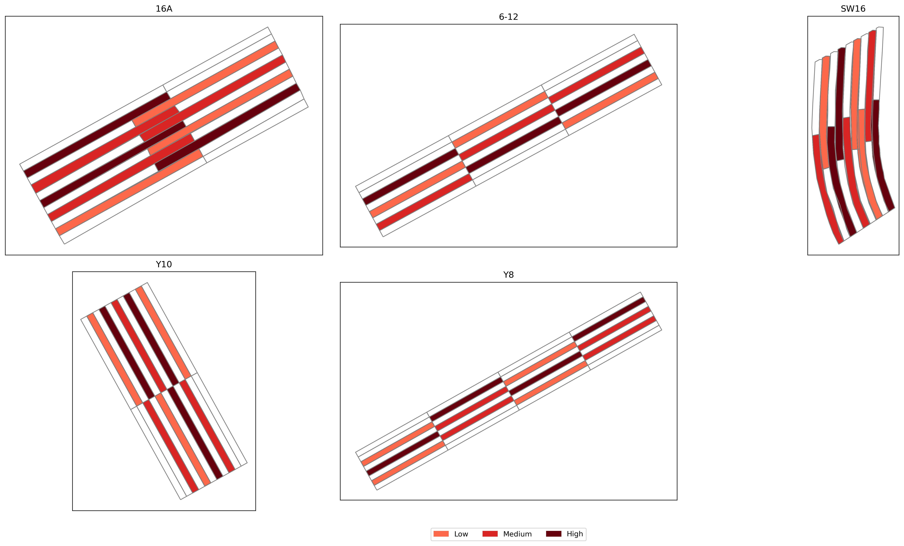

# Repository for code and data for the analysis of yield in Temple, TX
This repository containes all relevant code to analyze the effects of soil and rainfall on yield during the years 2018, 2019, 2020, and 2022

Soil data was collected in 2018 for each plot in this study and interpolated to get soil values corresponding to all yield values.

A portion of this analysis was performed on the USDA SCINet high-performance computer. Relevant code and data for HPC analyses are in the HPC_code folder.

Figure 1. Each field with outlines for all plots colored by treatment.